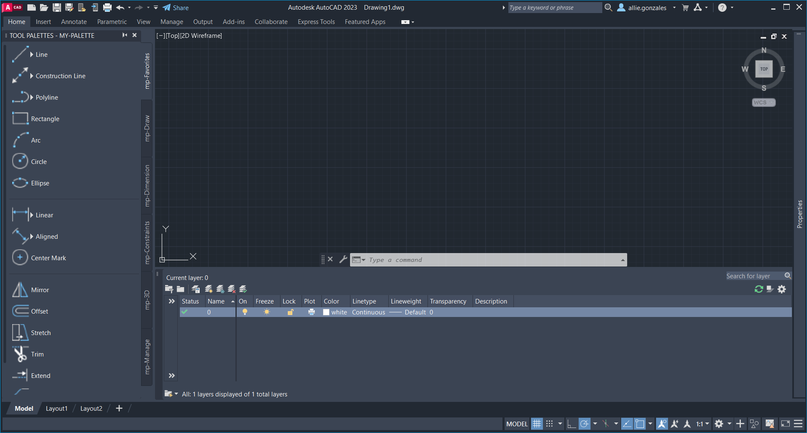

# AutoCAD 2023 - My External Tool Palette
External tool palette for AutoCAD 2023. Lists commonly used commands from **Draw** and **Dimension** toolbars. This method of accessing AutoCAD tools and commands intends to limit the use of the ribbon and encourage the use of the **Command Line**. However, making an entry to the command line isn't always the fastest way to complete a command as one hand may have to touch several keys before AutoCAD autocompletes the command's shorthand name. The **Tool Palette** enables the user to list frequently used commands to a **Palette** and organize them into **Palette Groups**, tabs listed to the right on the tool palette. This method speeds up the workflow by making tools and commands accessible in more than one place, and displays the command's name explicitly to improve precision.

Check out my AutoCAD shortcuts cheat sheet here: [github.com/EvokeMadness/autoCAD-2023-cheat-sheets](https://github.com/EvokeMadness/autoCAD-2023-cheat-sheets)

A capture of the default workspace I use in AutoCAD 2023
